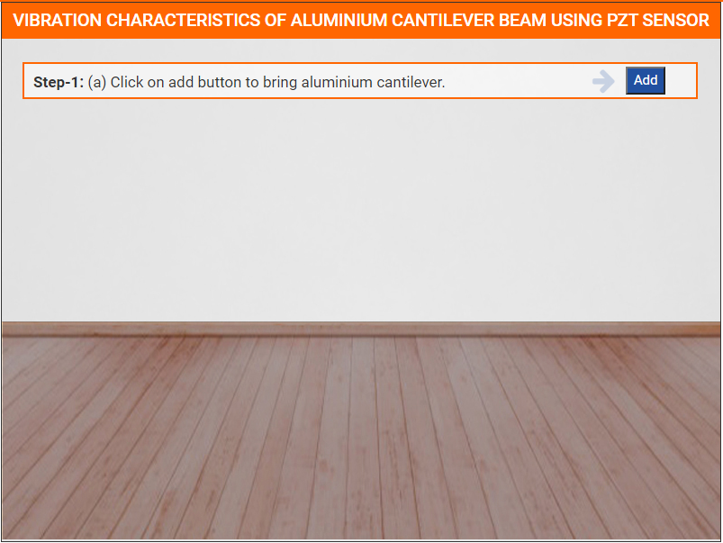
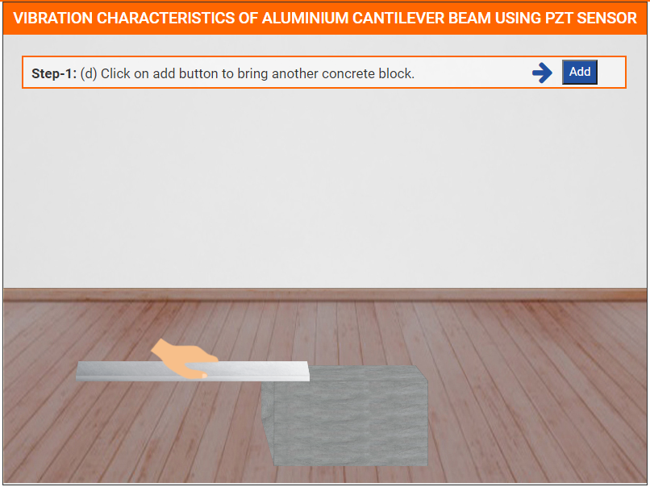
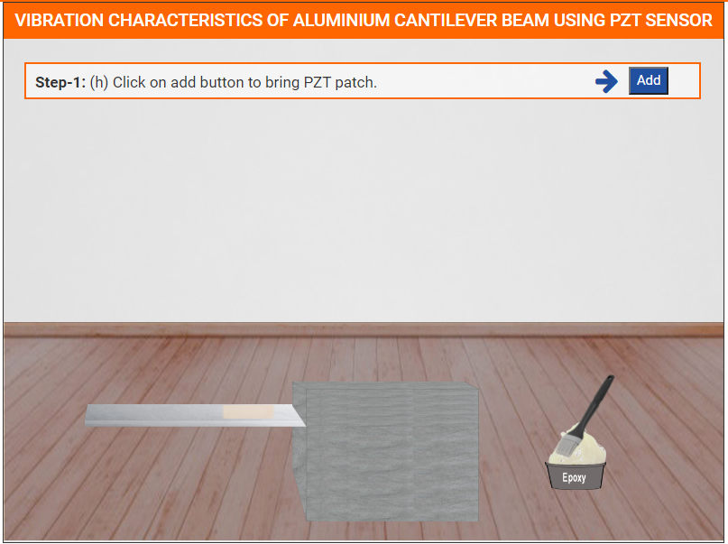
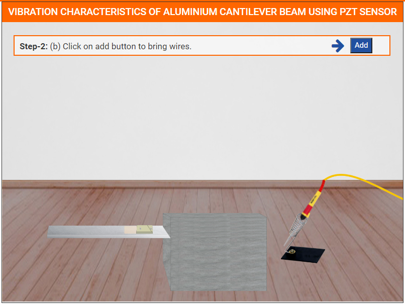

### These steps will be followed for the experiment

**PRE EXPRIMENT QUIZ QUESTIONS**
	
1) What is natural frequency?
2) What is piezoelectric sensor?
3) What are free-damped oscillations?
4) What is damping ratio?
5) What is the relation between damping ratio and natural frequency?

#### Preparation of specimens:

1. Click on Start Experiment button to start the experiment.

2. Click on Add button to bring Aluminium Cantilever.

3. Click on Add button to bring Concrete Block.

4. Click on Aluminium Cantilever to place it on the Concrete Block.

5. Click on Add button to bring another Concrete Block.

6. Click on another Concrete Block to place it on the Aluminium Cantilever.

7. Click on Add button to bring PZT Patch.

8. Click on PZT Patch to fix it on the Aluminium Cantilever.

9. Click on Add button to bring Hammer.

10. Click on Hammer to place it on the position.

11. Click on Add button to bring Digital Multimeter.

12. Click on both clips one by one to attach wires with PZT wires.

13. Switch on the power button of Digital Multimeter.

14. Click on Hammer button to start hammer.

**POST EXPRIMENT QUIZ QUESTIONS**

1) Plot the voltage response in time domain in MS Excel.
2) Using Matlab convert the voltage response from time domain to
frequency domain and plot the graph.
3) Calculate the natural frequency of the beam from the frequency plot.
4) Calculate the damping ratio using half power band method.
5) Compare the experimental damping ratio with the value available in
literature.