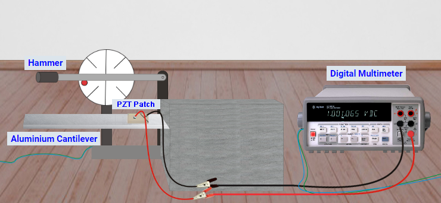
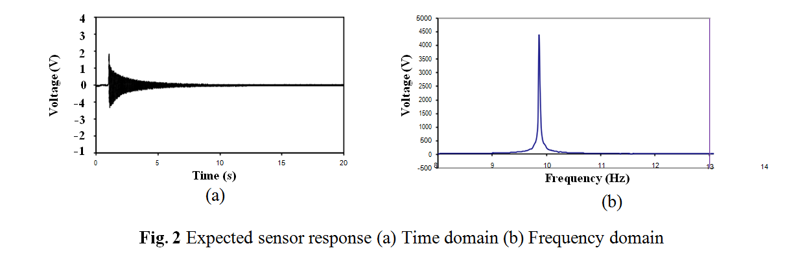

### EXPERIMENTAL METHODOLOGY
	
The experimental setup is as shown in Fig. 1. It consists of a cantilevered aluminium beam of dimensions 300 × 18.2 × 2.15 mm with a PZT sensor bonded on the surface near the point of fixity. The wires from the patch are connected to Agilent 34411A digital multi meter (DMM) which is in turn connected to the LAN port and thus accessible to the user through the internet/intranet.

The cantilever beam is excited into free-damped vibrations through an automatic mechanical exciter at regular intervals. As the beam vibrates, the surface strain fluctuates between compression and tension, thereby developing sinusoidally varying charge (and hence voltage) across the electrodes of the PZT sensor through the direct piezoelectric effect (http://ssdl.iitd.ac.in/vssdl/piezo.pdf) to learn more about piezoelectricity. The instantaneous voltage developed across the piezoelectric sensor is measured at the user specified time interval using the DMM. The VEE PRO based interactive dialogue box available in the main page of the experiment (http://ssdl.iitd.ac.in/vssdl/exp1.html) can be used for this purpose. A sampling rate of 1 millisecond and a total sampling time of 5s (total 5, 000 measurements) is recommended for best results. The dialogue box stores the time and the frequency domain data in the computer of the user. Plots are also available in the VEE PRO dialogue box.

**Fig. 1** Experimental set up

The user may plot the time domain data in excel to visualize the free damped oscillations more minutely. At the same time, through fast Fourier transform, the user can convert the time domain data (as a matrix of voltage output, <i>V_time</i>) in the frequency domain. If using MATLAB, following commands can be used:

This command will produce a matrix of voltage values in the frequency domain. The corresponding matrix of frequencies can be obtained by using following command

where <i>N</i> is the total number of samples in the time domain (here 5000) and <i>T</i> the sampling interval (here
0.001 second). It may be noted that the VEE PRO dialogue box also provides the matrix <i>V_fft</i>. The user may use it directly if MATLAB is not available. Fig. 2 shows typical time and frequency domain responses expected if the experiment is correctly performed.

From the frequency plot, the user can identify the natural frequency of the beam as the frequency corresponding to which peak voltage response is observed (here about 10 Hz). The damping ratio can be calculated using the half power band method (Paz, 2004) as

where fn is the frequency corresponding to peak response and f1 and f2 represent the frequencies corresponding to 0.707 of the peak response <i>(f2 > fn > f1)</i>. 
The user may compare the values obtained through this experiment with damping ratio available from the literature and the theoretical frequency given below (Paz, 2004).

Where <i>E</i> denotes the Young’s modulus of elasticity of the beam, <i>I</i> the moment of inertia, <i>ρ</i> the material density and <i>L</i> the length of the beam.
