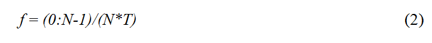

### Theory
	
This virtual experiment simulates vibrations of a cantilever beam under external excitation induced using a hammer, this type of excitation is called impact excitation. The simulated experimental setup is as shown in Fig. 1. It consists of a cantilevered aluminium beam of dimensions 300 × 18.2 × 2.15 mm with a piezoelectric ceramic (PZT) patch sensor bonded on the surface near the point of fixity. The wires from the patch are connected to digital multi meter (DMM)
<!--which is in turn connected to the LAN port and thus accessible to the user through the internet/intranet. -->

The cantilever beam is excited into free-damped vibrations through an automatic mechanical exciter at regular intervals. As the beam vibrates, the surface strain fluctuates between compression and tension, thereby developing sinusoidally varying charge (and hence voltage) across the electrodes of the PZT patch sensor through the direct piezoelectric effect for (more details click here to learn more about piezoelectricity). The instantaneous voltage developed across the piezoelectric sensor is measured at the user specified time interval using the DMM. The dialogue box enables downloading the time and the frequency domain data in the computer of the user.

	

	
**Fig. 1** Experimental set up
	

The user may plot the time domain data in excel to visualize the free damped oscillations more minutely. At the same time, through fast Fourier transform, the user can convert the time domain data (as an array of voltage output, <i>V_time</i>) in the frequency domain. If using MATLAB, following commands can be used:

This command will produce an array of voltage values in the frequency domain. The corresponding array of frequencies can be obtained by using following command

where <i>N</i> is the total number of samples in the time domain and <i>T</i> the sampling interval (here
0.001 second). The user may use it directly if MATLAB is not available. Fig. 2 shows typical time and frequency domain responses expected if the experiment is correctly performed.

From the frequency plot, the user can identify the natural frequency of the beam as the frequency corresponding to which peak voltage response is observed. The damping ratio can be calculated using the half power band method (Paz, 2004) as

where &#402;n is the frequency corresponding to peak response and &#402;1 and &#402;2 represent the frequencies corresponding to 0.707 of the peak response <i>(&#402;2 > &#402;n > &#402;1)</i>. 
The user may compare the values obtained through this experiment with damping ratio available from the literature and the theoretical frequency given below (Paz, 2004).

where <i>E</i> denotes the Young’s modulus of elasticity of the beam, <i>I</i> the moment of inertia, <i>ρ</i> the material density and <i>L</i> the length of the beam.
